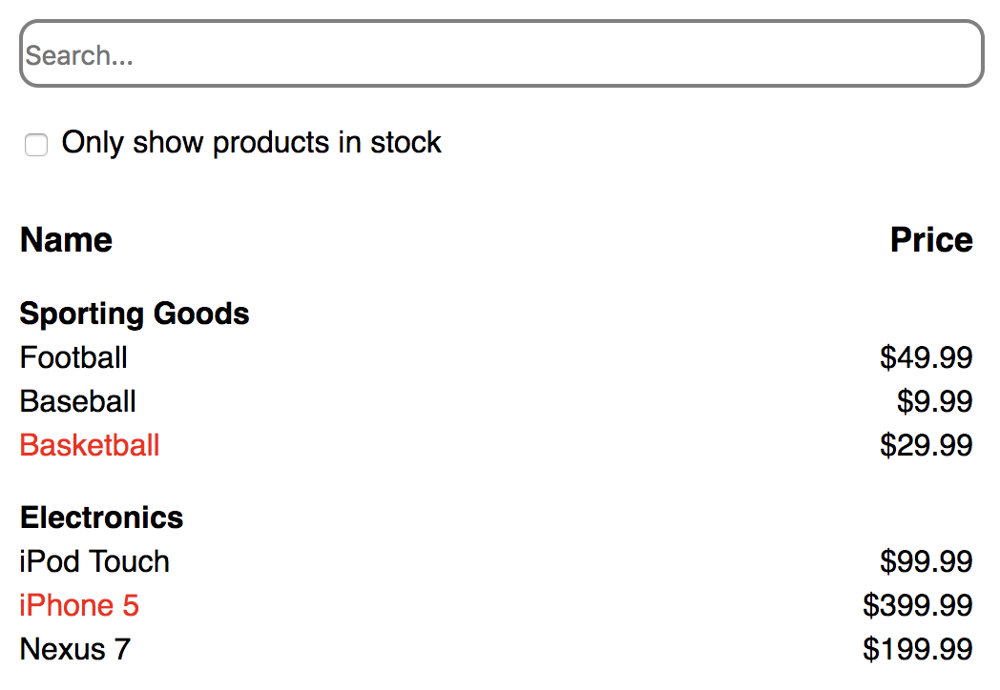

# FilterableProductProject

This is a products demo project, built with ReactJS.

# App Functionality

Users will be able to 
- check products by all or in stock
- search products by key words

# App Screenshot

# Installation Instructions

- clone my repo git clone https://github.com/mavisluan/FilterableProductProject.git
- install all project dependencies with yarn install
- start the development server with yarn start